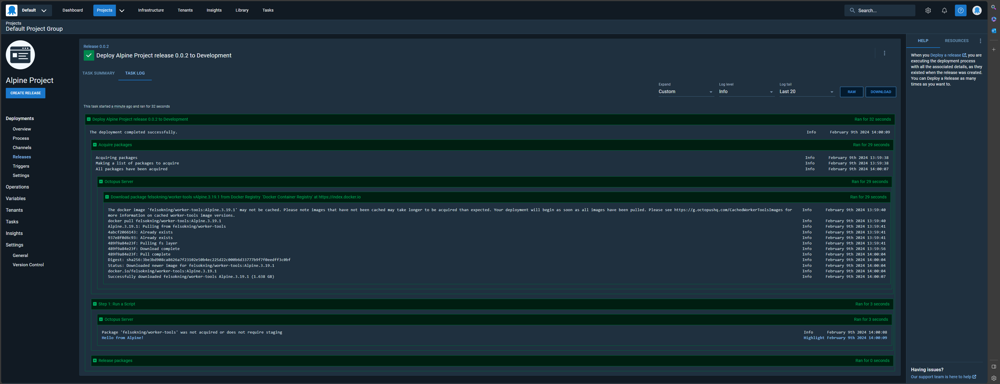

## DISCLAIMER :warning:
Octopus Deploy defines that [using non glibc distributions is _**not**_ supported by Calamari](https://octopus.com/docs/projects/steps/execution-containers-for-workers#supported-linux-distributions) -- most notably, Alpine. 

The Alpine version provided here has been verified to work on a local version of the Octopus Deploy Server container. 

YMMV with any and all scenarios with the Alpine images and PR's to address any issues would be highly appreciated.



# Worker Tools

Unofficially sanctioned worker images for Octopus Deploy available on [docker hub](https://hub.docker.com/r/felsokning/worker-tools)

| Operating System         | Installed Tools and Versions                                                                                                                         |
|--------------------------|------------------------------------------------------------------------------------------------------------------------------------------------------|
| Alpine 3.19              | ([Dockerfile](https://github.com/felsokning/worker-tools/blob/main/Alpine.3.19/Dockerfile))                                                          |
| Arch Linux               | ([Dockerfile](https://github.com/felsokning/worker-tools/blob/main/Arch/Dockerfile))                                                                 |
| Debian 11 (Bullseye)     | ([Dockerfile](https://github.com/felsokning/worker-tools/blob/main/Debian.11/Dockerfile))                                                            |
| Fedora                   | ([Dockerfile](https://github.com/felsokning/worker-tools/blob/main/Fedora/Dockerfile))                                                               |

# Docker Compose

Run the following commands in PowerShell to docker compose from the repository's root:

```
$tag=(Invoke-RestMethod "https://gitlab.archlinux.org/archlinux/archlinux-docker/-/tags?format=atom" | Sort-Object -Property updated -Descending | Select-Object -First 1 | Select-Object -ExpandProperty title).Replace("v", [string]::Empty)
docker-compose build --build-arg tag=$tag
```

## Management

The Worker Tools images provided by this repository are currently updated on at-best effort basis. This repository should contain the latest stable versions of all of the tools.

PRs are welcome. 

If the tools or the way they are managed don't fit your particular use case, it is easy to [create your own images](https://octopus.com/docs/projects/steps/execution-containers-for-workers#which-image) to use as execution containers.

## Getting Started

See the docs to get started using the `felsokning/worker-tools` image as an [execution container for workers](https://octopus.com/docs/deployment-process/execution-containers-for-workers).

The images I publish are [semantically versioned](https://semver.org/). 

To ensure stability within your deployment processes, I do not publish non-semantically versioned builds, to prevent breaking your deployment process. Use the full `major.minor.patch` tag when using the `felsokning/worker-tools` image - for example, use `felsokning/worker-tools:1.0.0-alpine.3.19`. 
